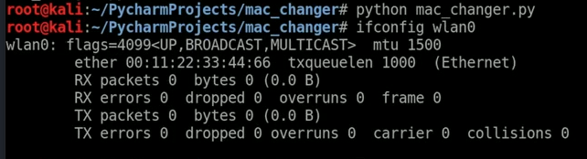

# MAC Changer
A Python program designed to automate the change of the MAC address of a personal computer on the Linux operating system.
Firstly, install library:
```sh
pip3 install subprocess
```
After that you can start script.

MAC address after python script: <br/>
